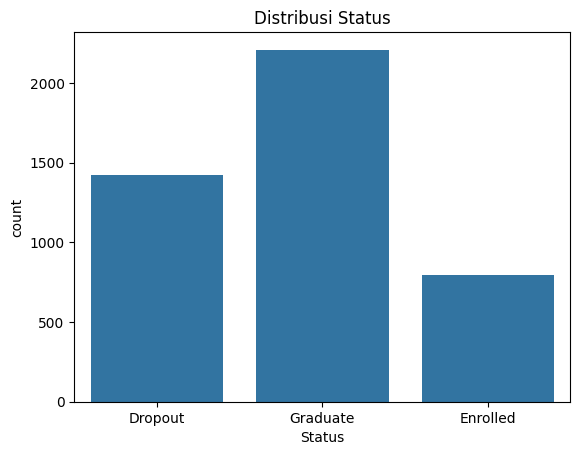
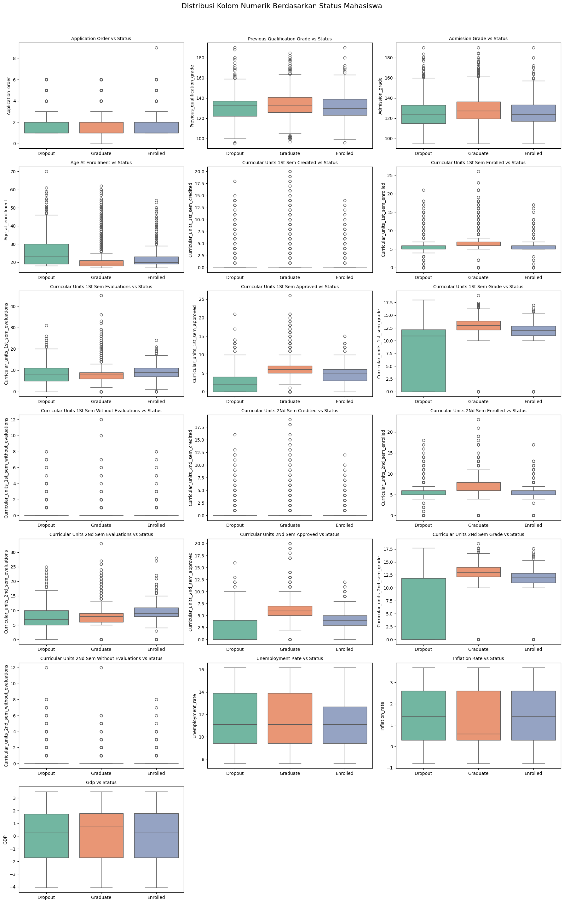
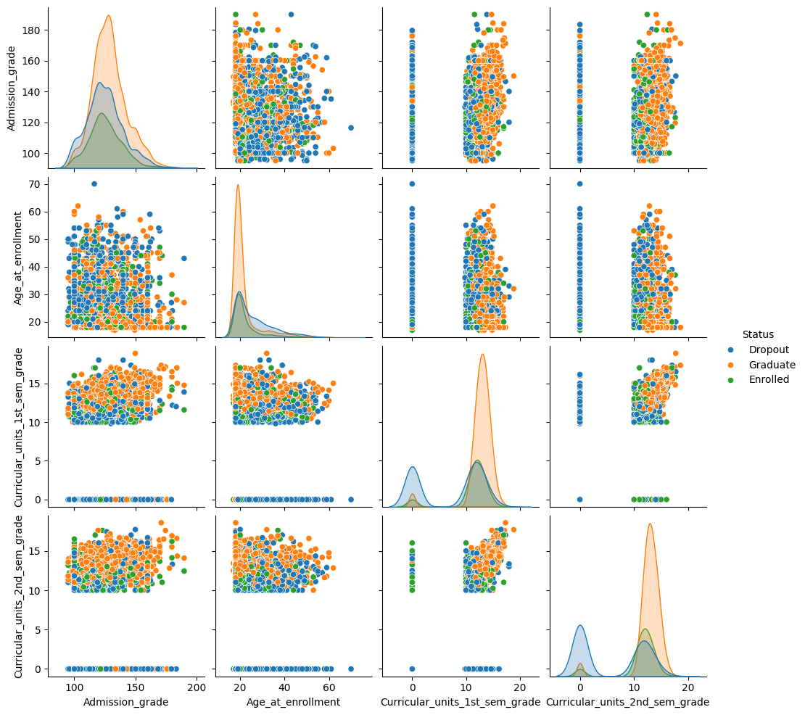
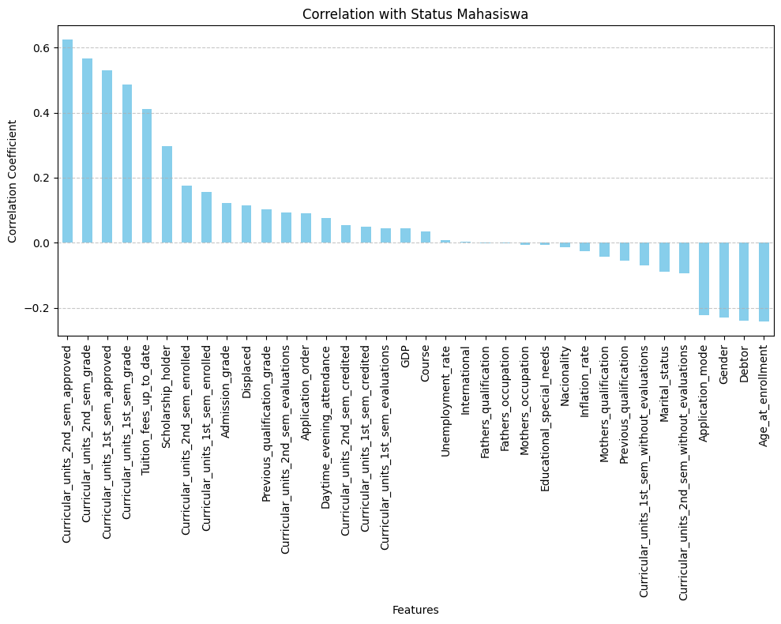
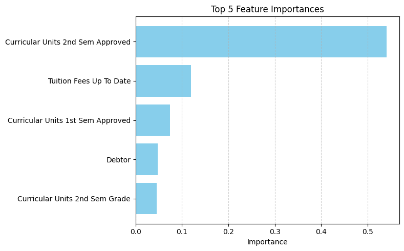

# Proyek Akhir: Menyelesaikan Permasalahan Institusi Pendidikan

### Business Understanding
Jaya Jaya Institut adalah institusi pendidikan tinggi yang telah beroperasi sejak tahun 2000. Dalam perjalanannya, institusi ini telah berhasil mencetak banyak lulusan berkualitas yang berkontribusi positif di berbagai sektor. Reputasi baik ini tentu menjadi kebanggaan dan modal penting bagi kelangsungan dan perkembangan institusi ke depan. Namun, dalam beberapa tahun terakhir, Jaya Jaya Institut menghadapi tantangan serius berupa tingginya angka mahasiswa yang tidak menyelesaikan studinya atau dropout. Fenomena ini berdampak langsung pada reputasi institusi, efektivitas program pembelajaran, serta perencanaan keuangan dan sumber daya. Mahasiswa yang dropout juga mencerminkan adanya potensi kegagalan dalam sistem pendampingan, pengajaran, atau bahkan dalam penerimaan mahasiswa sejak awal.

Sebagai respons atas permasalahan tersebut, manajemen Jaya Jaya Institut berkomitmen untuk mengambil pendekatan berbasis data dalam memahami akar masalah dan mencari solusi. Mereka menyadari pentingnya kemampuan untuk mendeteksi lebih awal mahasiswa yang berpotensi dropout agar institusi dapat memberikan intervensi yang tepat, seperti bimbingan akademik, konseling, atau dukungan finansial. Untuk mendukung upaya tersebut, mereka menyediakan data historis performa mahasiswa dan meminta pengembangan sistem prediktif berbasis data, termasuk visualisasi dalam bentuk dashboard, agar proses pemantauan dan pengambilan keputusan bisa dilakukan secara lebih efisien dan akurat.

### Permasalahan Bisnis
1. Tidak adanya sistem atau model prediktif untuk mengidentifikasi mahasiswa yang berpotensi dropout secara dini.

2. Kurangnya alat bantu visual (dashboard) bagi manajemen untuk memonitor performa akademik mahasiswa dan faktor-faktor terkait.

3. Keterbatasan informasi terstruktur yang dapat digunakan oleh pihak akademik untuk memberikan intervensi yang tepat waktu.

### Cakupan Proyek
1. Menganalisis dataset performa mahasiswa yang tersedia untuk memahami pola, tren, dan faktor utama yang memengaruhi keberhasilan atau dropout mahasiswa.

2. Mengembangkan model machine learning untuk memprediksi kemungkinan seorang mahasiswa mengalami dropout berdasarkan data akademik, demografis, dan sosial-ekonomi.

3. Menguji performa model prediktif menggunakan metrik evaluasi yang relevan (akurasi, recall, precision, dll).

4. Membangun dashboard visualisasi interaktif yang dapat digunakan oleh manajemen Jaya Jaya Institut untuk memantau performa mahasiswa dan hasil prediksi dropout secara berkala.

5. Memberikan saran strategis berbasis data untuk membantu institusi dalam melakukan intervensi dini terhadap mahasiswa yang teridentifikasi berisiko tinggi.

### Data Understanding
Dataset yang disediakan oleh Jaya Jaya Institut berisi data historis performa akademik dan informasi demografis siswa yang pernah terdaftar di institusi tersebut yang dapat diakses melalui [**Jaya Jaya Institut**](https://raw.githubusercontent.com/dicodingacademy/dicoding_dataset/refs/heads/main/students_performance/data.csv). Data ini dikumpulkan untuk membantu proses analisis dan prediksi risiko dropout pada siswa.

Fitur-fitur dalam dataset ini meliputi:

| Nama Kolom | Deskripsi |
| --- | --- |
| Status pernikahan | Status pernikahan mahasiswa. (Kategorikal) 1 – lajang 2 – menikah 3 – duda/janda 4 – cerai 5 – tinggal bersama tanpa nikah resmi 6 – pisah secara hukum |
| Mode pendaftaran | Metode pendaftaran yang digunakan oleh mahasiswa. (Kategorikal)  |
| Urutan pendaftaran | Urutan pilihan program saat mendaftar. (Numerik) 0 - pilihan pertama hingga 9 - pilihan terakhir |
| Program studi | Program studi yang diambil mahasiswa. (Kategorikal)  |
| Kehadiran pagi/malam | Apakah mahasiswa mengikuti kelas pagi atau malam. (Kategorikal) 1 – pagi 0 – malam |
| Kualifikasi sebelumnya | Kualifikasi yang diperoleh mahasiswa sebelum masuk perguruan tinggi. (Kategorikal)  |
| Nilai kualifikasi sebelumnya | Nilai dari kualifikasi sebelumnya (antara 0 hingga 200) |
| Kewarganegaraan | Kewarganegaraan mahasiswa. (Kategorikal)  |
| Kualifikasi ibu | Kualifikasi pendidikan ibu mahasiswa. (Kategorikal)  |
| Kualifikasi ayah | Kualifikasi pendidikan ayah mahasiswa. (Kategorikal)  |
| Pekerjaan ibu | Pekerjaan ibu mahasiswa. (Kategorikal)  |
| Pekerjaan ayah | Pekerjaan ayah mahasiswa. (Kategorikal)  |
| Nilai masuk | Nilai ujian masuk (antara 0 hingga 200) |
| Perantau | Apakah mahasiswa berasal dari luar daerah. (Kategorikal) 1 – ya 0 – tidak |
| Kebutuhan pendidikan khusus | Apakah mahasiswa memiliki kebutuhan khusus. (Kategorikal) 1 – ya 0 – tidak |
| Penunggak | Apakah mahasiswa memiliki tunggakan. (Kategorikal) 1 – ya 0 – tidak |
| Pembayaran UKT lancar | Apakah mahasiswa membayar biaya kuliah tepat waktu. (Kategorikal) 1 – ya 0 – tidak |
| Jenis kelamin | Jenis kelamin mahasiswa. (Kategorikal) 1 – laki-laki 0 – perempuan |
| Penerima beasiswa | Apakah mahasiswa menerima beasiswa. (Kategorikal) 1 – ya 0 – tidak |
| Usia saat mendaftar | Usia mahasiswa saat mendaftar. (Numerik) |
| Mahasiswa internasional | Apakah mahasiswa adalah mahasiswa internasional. (Kategorikal) 1 – ya 0 – tidak |
| SKS semester 1 (diakui) | Jumlah SKS yang diakui di semester 1. (Numerik) |
| SKS semester 1 (diambil) | Jumlah SKS yang diambil di semester 1. (Numerik) |
| SKS semester 1 (dengan penilaian) | Jumlah SKS yang dinilai di semester 1. (Numerik) |
| SKS semester 1 (lulus) | Jumlah SKS yang lulus di semester 1. (Numerik) |
| Nilai rata-rata semester 1 | Nilai rata-rata pada semester 1 (antara 0 hingga 20) |
| SKS semester 1 (tanpa penilaian) | Jumlah SKS yang tidak memiliki penilaian di semester 1 |
| SKS semester 2 (diakui) | Jumlah SKS yang diakui di semester 2 |
| SKS semester 2 (diambil) | Jumlah SKS yang diambil di semester 2 |
| SKS semester 2 (dengan penilaian) | Jumlah SKS yang dinilai di semester 2 |
| SKS semester 2 (lulus) | Jumlah SKS yang lulus di semester 2 |
| Nilai rata-rata semester 2 | Nilai rata-rata pada semester 2 (antara 0 hingga 20) |
| SKS semester 2 (tanpa penilaian) | Jumlah SKS yang tidak memiliki penilaian di semester 2 |
| Tingkat pengangguran | Tingkat pengangguran (%) |
| Tingkat inflasi | Tingkat inflasi (%) |
| PDB | Produk Domestik Bruto |
| Target | Target klasifikasi. Masalah ini diformulasikan sebagai tugas klasifikasi tiga kategori: putus kuliah, masih terdaftar, dan lulus. |

Dataset ini terdiri dari **4424 baris data** dan **37 atribut** dengan sebaran tipe data sebagai berikut.

| No | Column Name                                  | Non-Null Count | Dtype    |
|----|----------------------------------------------|----------------|----------|
| 1  | Marital_status                                | 4424           | int64    |
| 2  | Application_mode                              | 4424           | int64    |
| 3  | Application_order                             | 4424           | int64    |
| 4  | Course                                        | 4424           | int64    |
| 5  | Daytime_evening_attendance                    | 4424           | int64    |
| 6  | Previous_qualification                        | 4424           | int64    |
| 7  | Previous_qualification_grade                  | 4424           | float64  |
| 8  | Nacionality                                   | 4424           | int64    |
| 9  | Mothers_qualification                         | 4424           | int64    |
| 10 | Fathers_qualification                         | 4424           | int64    |
| 11 | Mothers_occupation                            | 4424           | int64    |
| 12 | Fathers_occupation                            | 4424           | int64    |
| 13 | Admission_grade                               | 4424           | float64  |
| 14 | Displaced                                     | 4424           | int64    |
| 15 | Educational_special_needs                     | 4424           | int64    |
| 16 | Debtor                                        | 4424           | int64    |
| 17 | Tuition_fees_up_to_date                       | 4424           | int64    |
| 18 | Gender                                        | 4424           | int64    |
| 19 | Scholarship_holder                            | 4424           | int64    |
| 20 | Age_at_enrollment                             | 4424           | int64    |
| 21 | International                                 | 4424           | int64    |
| 22 | Curricular_units_1st_sem_credited             | 4424           | int64    |
| 23 | Curricular_units_1st_sem_enrolled             | 4424           | int64    |
| 24 | Curricular_units_1st_sem_evaluations          | 4424           | int64    |
| 25 | Curricular_units_1st_sem_approved             | 4424           | int64    |
| 26 | Curricular_units_1st_sem_grade                | 4424           | float64  |
| 27 | Curricular_units_1st_sem_without_evaluations  | 4424           | int64    |
| 28 | Curricular_units_2nd_sem_credited             | 4424           | int64    |
| 29 | Curricular_units_2nd_sem_enrolled             | 4424           | int64    |
| 30 | Curricular_units_2nd_sem_evaluations          | 4424           | int64    |
| 31 | Curricular_units_2nd_sem_approved             | 4424           | int64    |
| 32 | Curricular_units_2nd_sem_grade                | 4424           | float64  |
| 33 | Curricular_units_2nd_sem_without_evaluations  | 4424           | int64    |
| 34 | Unemployment_rate                             | 4424           | float64  |
| 35 | Inflation_rate                                | 4424           | float64  |
| 36 | GDP                                           | 4424           | float64  |
| 37 | Status                                        | 4424           | object   |


Untuk menjamin kualitas data, dilakukan pengecekan terhadap adanya baris data yang identik (duplikat) serta memastikan bahwa tidak terdapat nilai yang hilang (missing values) di dalam dataset.

```python
# Cek duplicate
print('Jumlah data duplikat:', df.duplicated().sum())

Output:
Jumlah data duplikat: 0 
```
Dataset tidak mengandung baris duplikat, sehingga tidak diperlukan proses penghapusan data yang sama.

```python
# Cek missing values
print("Cek missing value:")
print(df.isnull().sum())

Output:
Cek missing value:
Marital_status                                  0
Application_mode                                0
Application_order                               0
Course                                          0
Daytime_evening_attendance                      0
Previous_qualification                          0
Previous_qualification_grade                    0
Nacionality                                     0
Mothers_qualification                           0
Fathers_qualification                           0
Mothers_occupation                              0
Fathers_occupation                              0
Admission_grade                                 0
Displaced                                       0
Educational_special_needs                       0
Debtor                                          0
Tuition_fees_up_to_date                         0
Gender                                          0
Scholarship_holder                              0
Age_at_enrollment                               0
International                                   0
Curricular_units_1st_sem_credited               0
Curricular_units_1st_sem_enrolled               0
Curricular_units_1st_sem_evaluations            0
Curricular_units_1st_sem_approved               0
Curricular_units_1st_sem_grade                  0
Curricular_units_1st_sem_without_evaluations    0
Curricular_units_2nd_sem_credited               0
Curricular_units_2nd_sem_enrolled               0
Curricular_units_2nd_sem_evaluations            0
Curricular_units_2nd_sem_approved               0
Curricular_units_2nd_sem_grade                  0
Curricular_units_2nd_sem_without_evaluations    0
Unemployment_rate                               0
Inflation_rate                                  0
GDP                                             0
Status                                          0
```
Hasil pemeriksaan menunjukkan bahwa tidak terdapat missing value pada dataset ini, sehingga tidak diperlukan tindakan lebih lanjut untuk menangani data yang hilang.

Setelah tahap pemahaman data (data understanding) selesai dilakukan, langkah berikutnya adalah melakukan Exploratory Data Analysis (EDA). Tahapan ini bertujuan untuk menggali pola, hubungan, serta karakteristik dari setiap fitur dalam dataset, baik secara individual (univariat) maupun antar fitur (multivariat). Melalui EDA, kita dapat mengidentifikasi potensi outlier, ketidakseimbangan kelas, serta fitur-fitur yang memiliki pengaruh terhadap variabel target, yaitu Status mahasiswa.


Grafik di atas menunjukkan proporsi dari tiga kategori dalam variabel target Status mahasiswa: “Graduate”, “Enrolled”, dan “Dropout”. Distribusi ini memperlihatkan adanya ketidakseimbangan kelas, di mana proporsi mahasiswa yang “Graduate” mendominasi dataset, sementara kategori “Dropout” berada di posisi paling rendah. Ketidakseimbangan ini penting untuk diperhatikan dalam pemodelan, karena dapat mempengaruhi performa algoritma klasifikasi, khususnya dalam hal generalisasi terhadap kelas minoritas.


Gambar ini memperlihatkan distribusi variabel target Status mahasiswa terhadap beberapa fitur numerik, seperti Admission Grade, Age at Enrollment, Curricular Units 1st Semester Grade, dan Curricular Units 2nd Semester Grade. Distribusi yang terbentuk menunjukkan bahwa mahasiswa dengan status “Graduate” cenderung memiliki nilai akademik yang lebih tinggi dibandingkan kelompok lainnya, terutama pada nilai semester pertama dan kedua. Selain itu, mahasiswa dengan usia lebih tinggi saat mendaftar tampak lebih sering mengalami dropout. Hal ini mengisyaratkan bahwa performa akademik dan faktor usia merupakan indikator penting yang memengaruhi keberhasilan studi mahasiswa.


Visualisasi ini menampilkan hubungan antara fitur-fitur kategorikal dengan variabel target Status. Beberapa fitur seperti Debtor, Tuition Fees Up to Date, dan Scholarship Holder menunjukkan perbedaan distribusi yang cukup mencolok antar kelas Status. Misalnya, mahasiswa yang berstatus sebagai debtor atau yang tidak membayar biaya kuliah tepat waktu memiliki kecenderungan lebih tinggi untuk dropout. Temuan ini menunjukkan bahwa kondisi sosial-ekonomi mahasiswa berperan penting dalam keberlangsungan studi mereka, dan fitur-fitur kategorikal tersebut dapat dijadikan indikator prediktif yang relevan dalam model klasifikasi.


Pairplot ini menyajikan hubungan dua variabel antar fitur numerik utama terhadap Status. Terlihat adanya pemisahan yang cukup jelas antara kelompok “Graduate” dan “Dropout” pada dimensi nilai akademik dan usia. Mahasiswa yang dropout cenderung terkonsentrasi pada area dengan nilai akademik rendah, sementara mahasiswa graduate memiliki sebaran nilai yang lebih tinggi dan stabil. Hubungan linier dan penyebaran antar fitur ini memberikan wawasan tentang potensi pemisahan kelas secara visual, yang dapat dimanfaatkan dalam klasifikasi.


Grafik di atas menggambarkan kekuatan dan arah hubungan linier antara variabel numerik dalam dataset dengan variabel target, yakni Status Mahasiswa. Beberapa fitur menunjukkan korelasi positif yang cukup tinggi, seperti Admission_grade, Curricular_units_1st_sem_grade, dan Curricular_units_2nd_sem_grade. Hal ini mengindikasikan bahwa semakin tinggi nilai akademik mahasiswa pada saat masuk maupun selama perkuliahan, maka semakin besar kemungkinan mahasiswa tersebut untuk menyelesaikan studinya. Sebaliknya, fitur seperti Curricular_units_1st_sem_without_evaluations menunjukkan korelasi negatif, yang berarti ketidakterlibatan mahasiswa dalam evaluasi akademik dapat menjadi indikator kuat terhadap risiko dropout. Temuan ini menunjukkan bahwa performa akademik sangat berkontribusi terhadap keberhasilan mahasiswa dalam menyelesaikan studi.

### Data Preprocessing
Tahap data preparation merupakan langkah krusial untuk memastikan bahwa data yang akan digunakan dalam proses machine learning berada dalam kondisi optimal, bersih, dan merepresentasikan karakteristik sebenarnya. Berikut ini adalah serangkaian proses yang dilakukan dalam tahap tersebut:

```python
# Ambil data hanya dengan label Dropout dan Graduate
df_binary = df[df['Status'].isin(['Dropout', 'Graduate'])].copy()
df_binary['Status'] = df_binary['Status'].map({'Dropout': 1, 'Graduate': 0})
```
Seperti yang telah disebutkan sebelumnya, tujuan dari proyek ini adalah untuk memprediksi mahasiswa yang berpotensi dropout dan mengidentifikasi siapa saja yang membutuhkan dukungan lebih. Untuk itu kelas menengah (‘Enrolled’) akan dihapus, dan model akan dilatih menggunakan label biner: 1 untuk 'Dropout' dan 0 untuk 'Graduate'.

```python
# Pisahkan fitur dan target
X = df_binary.drop(columns=['Status'])
y = df_binary['Status']
```
Langkah selanjutnya adalah memisahkan fitur (X) dan target (y) dari data yang telah difilter. Fitur digunakan sebagai input yang akan dipelajari oleh model, sementara target menjadi label atau jawaban yang ingin diprediksi. Proses ini penting untuk menjaga validitas model, menghindari kebocoran informasi (data leakage), dan memastikan bahwa algoritma hanya mengandalkan variabel yang relevan dalam membentuk pola prediksi terhadap kemungkinan mahasiswa mengalami dropout.

```python
# Seleksi maksimal 10 fitur terbaik berdasarkan ANOVA F-score
k = min(10, X.shape[1])  # pastikan tidak lebih dari jumlah total fitur
selector = SelectKBest(score_func=f_classif, k=k)
X_selected = selector.fit_transform(X, y)

# Ambil nama kolom fitur terpilih
selected_columns = X.columns[selector.get_support()]
print("Top Features:", list(selected_columns))

Output:
Top Features: ['Application_mode', 'Debtor', 'Tuition_fees_up_to_date', 'Gender', 'Scholarship_holder', 'Age_at_enrollment', 'Curricular_units_1st_sem_approved', 'Curricular_units_1st_sem_grade', 'Curricular_units_2nd_sem_approved', 'Curricular_units_2nd_sem_grade']
```
Pemilihan fitur merupakan tahapan penting dalam proses praproses data yang bertujuan untuk meningkatkan performa dan efisiensi model pembelajaran mesin. Pada penelitian ini, digunakan metode SelectKBest dengan skor ANOVA F (f_classif) untuk mengidentifikasi sepuluh fitur paling relevan terhadap variabel target. Pemilihan maksimal sepuluh fitur didasarkan pada pertimbangan efisiensi komputasi serta kebutuhan integrasi model ke dalam sistem prediksi berbasis dashboard, yang menuntut model yang ringan namun tetap akurat. Dengan memfokuskan pelatihan pada fitur-fitur yang memiliki kontribusi paling signifikan terhadap klasifikasi, proses ini tidak hanya mengurangi kompleksitas model dan risiko overfitting, tetapi juga meningkatkan interpretabilitas model dalam konteks aplikasi nyata.

```python
# Scaling data
scaler = StandardScaler()
X_scaled = scaler.fit_transform(X_selected)

# Gunakan nama kolom asli untuk menjaga feature names
X_scaled_df = pd.DataFrame(X_scaled, columns=selected_columns)

# Split data
X_train, X_test, y_train, y_test = train_test_split(X_scaled_df, y, test_size=0.2, random_state=42, stratify=y)
```
Proses scaling data dilakukan untuk menyetarakan skala antar fitur numerik, agar algoritma pembelajaran mesin tidak bias terhadap fitur dengan nilai absolut yang lebih besar. Dalam hal ini, digunakan StandardScaler untuk mentransformasi setiap fitur sehingga memiliki rata-rata nol dan standar deviasi satu. Hal ini penting terutama bagi algoritma yang sensitif terhadap skala fitur. Selanjutnya, data dibagi menjadi data latih dan data uji dengan perbandingan 80:20 menggunakan metode train_test_split dengan parameter stratify. Teknik stratified sampling ini diterapkan untuk memastikan proporsi kelas target (Dropout dan Graduate) tetap seimbang pada kedua subset, sehingga hasil evaluasi model menjadi lebih representatif dan dapat diandalkan.

### Modelling
Pada tahap modelling, proses penyusunan dan pelatihan model prediktif dilakukan dengan tujuan utama untuk mengidentifikasi mahasiswa yang berisiko tinggi mengalami dropout. Dalam proyek ini, digunakan algoritma XGBoostClassifier, yang dikenal efektif dalam menangani masalah klasifikasi biner serta memiliki kapabilitas dalam mengelola fitur numerik dan kategorikal secara efisien. Untuk meningkatkan performa model, dilakukan optimasi hyperparameter secara sistematis menggunakan pustaka Optuna, yang menerapkan pendekatan berbasis Bayesian optimization guna menjelajahi ruang pencarian parameter secara adaptif dan efisien. Strategi ini memungkinkan model mencapai konfigurasi optimal berdasarkan metrik evaluasi akurasi. 

```python
# Hyperparameter search space
param = {
    'objective': 'binary:logistic',  # binary classification problem
    'eval_metric': 'logloss',  # evaluation metric
    'max_depth': trial.suggest_int('max_depth', 3, 10),  # max depth of trees
    'learning_rate': trial.suggest_float('learning_rate', 0.01, 0.3),  # learning rate
    'n_estimators': trial.suggest_int('n_estimators', 50, 500),  # number of trees
    'subsample': trial.suggest_float('subsample', 0.5, 1.0),  # fraction of samples to train each tree
    'colsample_bytree': trial.suggest_float('colsample_bytree', 0.5, 1.0),  # fraction of features to train each tree
    'gamma': trial.suggest_float('gamma', 0, 5),  # regularization term
    'min_child_weight': trial.suggest_int('min_child_weight', 1, 10),  # min sum of instance weight
}

# Train XGBClassifier with these parameters
model = XGBClassifier(**param, use_label_encoder=False, random_state=42)

# Fit the model
model.fit(X_train, y_train)

# Create Optuna study and optimize
study = optuna.create_study(direction='maximize')  # Maximize accuracy
study.optimize(objective, n_trials=50)  # Number of trials to perform
```

Pada potongan kode di atas, terlebih dahulu didefinisikan ruang pencarian hyperparameter yang mencakup aspek kompleksitas model (max_depth), kecepatan pembelajaran (learning_rate), jumlah pohon keputusan (n_estimators), proporsi data dan fitur yang digunakan dalam setiap iterasi pelatihan (subsample, colsample_bytree), serta parameter regularisasi seperti gamma dan min_child_weight. Selanjutnya, model dilatih menggunakan kombinasi parameter yang dihasilkan oleh Optuna, dan evaluasi akurasi dilakukan untuk setiap iterasi percobaan. Proses ini diulang sebanyak 50 kali (n_trials=50), sehingga diperoleh konfigurasi parameter terbaik yang mampu memaksimalkan performa model pada data uji.

### Evaluation
Setelah proses pelatihan dan optimasi parameter dilakukan, diperoleh hasil sebagai berikut:

|               | Precision | Recall | F1-score | Support |
|---------------|----------|--------|----------|---------|
| Graduate      |   0.92   |  0.94  |   0.93   |   442   |
| Dropout       |   0.91   |  0.87  |   0.89   |   284   |
| **Accuracy**  |          |        |   0.92   |   726   |
| Macro avg     |   0.91   |  0.91  |   0.91   |   726   |
| Weighted avg  |   0.92   |  0.92  |   0.92   |   726   |

Hasil evaluasi model menunjukkan bahwa model memiliki performa yang sangat baik dalam mengklasifikasikan kedua kelas, yaitu "Graduate" dan "Dropout". Untuk kelas "Graduate", model mencapai presisi sebesar 0.92, recall 0.94, dan f1-score 0.93, yang menunjukkan kemampuannya dalam mendeteksi mahasiswa yang lulus dengan akurat dan mengurangi kesalahan positif. Di sisi lain, untuk kelas "Dropout", model menghasilkan presisi 0.91, recall 0.87, dan f1-score 0.89, yang mengindikasikan bahwa meskipun model cukup efektif, masih ada beberapa mahasiswa yang berpotensi dropout yang tidak terdeteksi dengan sempurna. Secara keseluruhan, akurasi model mencapai 92%, dengan nilai rata-rata makro dan tertimbang masing-masing 0.91 dan 0.92, yang menunjukkan keseimbangan dan efektivitas model dalam mengklasifikasikan kedua kelas tersebut.


Berdasarkan hasil Feature Importance dalam penelitian ini menunjukkan bahwa beberapa faktor sangat mempengaruhi prediksi status mahasiswa terkait potensi dropout dan kelulusan. Fitur Curricular Units 2nd Sem Approved memiliki kontribusi terbesar dengan nilai importance sebesar 0.487948, yang mengindikasikan bahwa keberhasilan mahasiswa dalam menyelesaikan unit kurikuler pada semester kedua berperan penting dalam memprediksi apakah mereka akan drop out atau lulus. Hal ini mencerminkan betapa pentingnya prestasi akademik mahasiswa dalam mempertahankan status akademiknya. Fitur Tuition Fees Up To Date juga memiliki pengaruh signifikan dengan nilai importance sebesar 0.125859, menunjukkan bahwa status pembayaran biaya kuliah menjadi faktor penting dalam prediksi status mahasiswa. Fitur Scholarship Holder (0.051228) dan Debtor (0.041262) juga memberikan kontribusi yang cukup besar, mengindikasikan bahwa masalah finansial mahasiswa, seperti penerimaan beasiswa atau status sebagai debitur, berhubungan erat dengan kemungkinan mereka untuk drop out. Meskipun demikian, fitur seperti Curricular Units 1st Sem Grade (0.030675) dan Application Mode (0.032797) memiliki kontribusi yang lebih kecil, menunjukkan bahwa meskipun keduanya relevan, mereka tidak sepenting faktor-faktor lain dalam memprediksi status mahasiswa. Secara keseluruhan, faktor-faktor terkait prestasi akademik dan status finansial mahasiswa memainkan peran yang lebih dominan dalam menentukan apakah seorang mahasiswa berisiko drop out atau lulus.

### Business Dashboard


### Conclusion
Berdasarkan hasil analisis dan pemodelan prediksi status mahasiswa yakni dropout dan graduate, beberapa poin dapat disimpulkan sebagai berikut:

1. **Faktor Penyebab Dropout:** Faktor yang paling berpengaruh terhadap potensi mahasiswa untuk mengalami dropout adalah prestasi akademik, khususnya yang berhubungan dengan Curricular Units 2nd Sem Approved dan Curricular Units 2nd Sem Grade. Mahasiswa yang kesulitan dalam menyelesaikan unit kurikuler semester kedua cenderung berisiko lebih tinggi untuk dropout. Selain itu, Tuition Fees Up To Date menunjukkan bahwa masalah pembayaran biaya kuliah juga berperan besar dalam keputusan mahasiswa untuk melanjutkan atau berhenti dari pendidikan mereka. Mahasiswa yang tidak dapat memenuhi kewajiban finansial lebih rentan untuk mengalami dropout.

2. **Kinerja Model:** Model klasifikasi yang digunakan dalam penelitian ini berhasil memberikan akurasi yang tinggi dalam mengidentifikasi mahasiswa yang berstatus Graduate dan Dropout. F1-score dan precision untuk kelas Dropout lebih rendah dibandingkan dengan kelas Graduate, yang menunjukkan bahwa meskipun model cukup efektif dalam mengidentifikasi mahasiswa yang berpotensi lulus (Graduate), model ini masih menghadapi tantangan dalam mendeteksi mahasiswa yang berisiko dropout. Variabel-variabel seperti Age at Enrollment, Scholarship Holder, dan Curricular Units Grade berperan besar dalam memprediksi risiko dropout.

3. **Segmen Rentan Terhadap Dropout:** Mahasiswa yang lebih muda dan memiliki prestasi akademik yang rendah, terutama pada semester kedua, menunjukkan kecenderungan lebih tinggi untuk dropout. Selain itu, mahasiswa yang mengalami kesulitan finansial dan tidak dapat memenuhi pembayaran biaya kuliah juga berisiko lebih besar untuk keluar dari program pendidikan mereka.

Dengan hasil ini, institusi pendidikan dapat lebih fokus untuk memberikan dukungan kepada mahasiswa yang berisiko tinggi mengalami dropout. Strategi yang dapat diterapkan meliputi peningkatan pembinaan akademik di semester kedua dan peningkatan akses ke beasiswa atau bantuan finansial untuk membantu mahasiswa yang kesulitan dalam pembayaran biaya kuliah. Intervensi berbasis data ini dapat membantu meminimalkan tingkat dropout dan meningkatkan tingkat kelulusan mahasiswa.

### Rekomendasi Action Items
1. Fokus pada Dukungan Akademik: Berdasarkan pentingnya prestasi akademik, terutama pada semester kedua, institusi pendidikan sebaiknya memberikan dukungan lebih pada mahasiswa yang kesulitan dalam menyelesaikan mata kuliah di semester tersebut. Program bimbingan atau kursus tambahan dapat diterapkan untuk mahasiswa yang berisiko mengalami kesulitan.

2. Pemberian Bantuan Keuangan: Karena masalah finansial, seperti status debitur dan ketidakmampuan dalam membayar biaya kuliah, berkontribusi terhadap risiko drop out, institusi harus memperkuat program bantuan keuangan atau beasiswa bagi mahasiswa yang membutuhkan, untuk memastikan bahwa aspek keuangan tidak menghambat pendidikan mereka.

3. Monitoring Mahasiswa Berdasarkan Risiko: Menggunakan model prediksi, institusi dapat memantau mahasiswa yang berisiko tinggi untuk drop out dan memberikan intervensi yang lebih dini, baik dalam bentuk dukungan akademik maupun finansial. Ini akan membantu meningkatkan tingkat kelulusan dan mengurangi tingkat dropout.

4. Peningkatan Kebijakan Beasiswa: Program beasiswa yang lebih luas dan terjangkau dapat membantu mahasiswa dengan masalah finansial untuk tetap melanjutkan pendidikan mereka. Ini termasuk memperluas kriteria penerima beasiswa atau menawarkan lebih banyak beasiswa berdasarkan prestasi maupun kebutuhan.

5. Pengembangan Sistem Peringatan Dini: Mengintegrasikan sistem peringatan dini berbasis data untuk mendeteksi mahasiswa yang menunjukkan tanda-tanda awal kesulitan, baik dalam hal akademik maupun finansial, akan memungkinkan pihak kampus untuk mengambil langkah proaktif dalam mendukung mereka.

### Cara Run Prediksi Drop Out
1. Pastikan Anda telah menginstal dependensi dengan:

```python
pip install -r requirements.txt
```
pada terminal

2. Jalankan skrip prediksi langsung di terminal:
```python
python prediksi.py
```

3. Masukkan data mahasiswa sesuai prompt yang muncul:
```yaml
Masukkan Application Mode (kategorik): 1st phase - general
Apakah mahasiswa memiliki utang? (Yes/No): No  
Apakah biaya kuliah sudah dibayar? (Yes/No): Yes  
Jenis Kelamin (Male/Female): Female  
Apakah penerima beasiswa? (Yes/No): No  
Usia saat mendaftar: 20  
Jumlah mata kuliah lulus semester 1: 6  
Rata-rata nilai semester 1: 12.3  
Jumlah mata kuliah lulus semester 2: 7  
Rata-rata nilai semester 2: 13.5
```

4. Output akan menampilkan hasil prediksi dan probabilitasnya:
```python
Prediksi: Dropout (84.72%)
```
