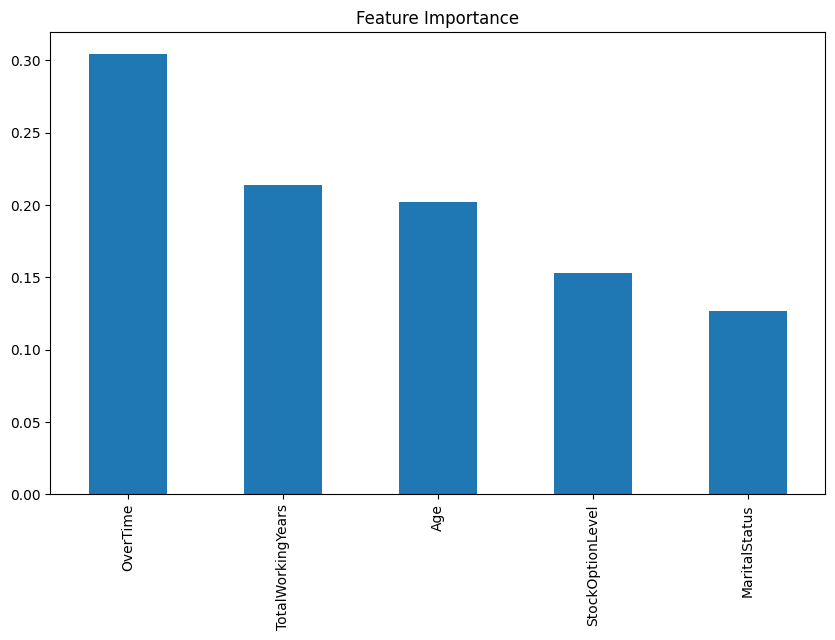

# Proyek Akhir: Menyelesaikan Permasalahan Perusahaan Edutech

### Business Understanding
Jaya Jaya Maju adalah perusahaan multinasional yang bergerak di bidang teknologi pendidikan (edutech) dan telah beroperasi sejak tahun 2000. Dengan lebih dari 1.000 karyawan yang tersebar di seluruh Indonesia, perusahaan ini berkomitmen untuk menyediakan solusi digital yang inovatif guna mendukung proses belajar-mengajar. Seiring dengan pertumbuhannya, Jaya Jaya Maju menghadapi tantangan signifikan dalam mengelola sumber daya manusia, terutama dalam hal mempertahankan talenta terbaik. Tingkat attrition (pergantian karyawan) yang tinggi, yaitu di atas 10%, menjadi perhatian utama karena berimplikasi langsung terhadap stabilitas operasional, efektivitas proyek, hingga kepuasan pelanggan. Fenomena ini menyebabkan lonjakan biaya rekrutmen dan pelatihan ulang, gangguan terhadap keberlangsungan tim, serta penurunan produktivitas secara keseluruhan.Oleh karena itu, diperlukan pendekatan berbasis data dan analitik prediktif untuk memahami faktor-faktor utama yang mendorong karyawan keluar dari perusahaan. 

### Permasalahan Bisnis
1. Belum adanya sistem yang mampu mengidentifikasi karyawan berisiko tinggi untuk keluar secara proaktif.

2. Kurangnya pemahaman terhadap faktor-faktor utama penyebab attrition, seperti kepuasan kerja, kompensasi, dan keseimbangan hidup.

3. Minimnya dukungan berbasis data dalam proses pengambilan keputusan manajemen terkait retensi karyawan.

### Cakupan Proyek
1. Melakukan pengumpulan dan eksplorasi data internal terkait karakteristik karyawan, kepuasan kerja, gaji, performa, dan lainnya.

2. Menerapkan teknik analisis data dan machine learning untuk memodelkan prediksi risiko attrition.

3. Mengidentifikasi fitur-fitur penting yang paling berpengaruh terhadap keputusan karyawan untuk keluar.

4. Membangun dashboard interaktif berbasis visualisasi untuk membantu tim HR dalam mengambil keputusan strategis berbasis data.

### Data Understanding
Proyek ini menggunakan data internal perusahaan Jaya Jaya Maju yang dapat diakses melalui [**Jaya Jaya Maju**](https://github.com/dicodingacademy/dicoding_dataset/tree/main/employee) merupakan kumpulan data karyawan di perusahaan. Dataset ini mencakup berbagai fitur penting yang dapat digunakan untuk membantu memprediksi risiko attrition berdasarkan karakteristik masing-masing karyawan.

Fitur-fitur dalam dataset ini meliputi:
* **EmployeeId** - ID unik karyawan  
* **Attrition** - Apakah karyawan mengundurkan diri? (0 = tidak, 1 = ya)  
* **Age** - Usia karyawan  
* **BusinessTravel** - Frekuensi perjalanan dinas karyawan  
* **DailyRate** - Gaji harian  
* **Department** - Departemen tempat karyawan bekerja  
* **DistanceFromHome** - Jarak dari rumah ke tempat kerja (dalam km)  
* **Education** - Tingkat pendidikan:  
  1 = Di bawah Perguruan Tinggi,  
  2 = Perguruan Tinggi,  
  3 = Sarjana,  
  4 = Magister,  
  5 = Doktor  
* **EducationField** - Bidang pendidikan  
* **EnvironmentSatisfaction** - Kepuasan terhadap lingkungan kerja:  
  1 = Rendah,  
  2 = Sedang,  
  3 = Tinggi,  
  4 = Sangat Tinggi  
* **Gender** - Jenis kelamin karyawan  
* **HourlyRate** - Gaji per jam  
* **JobInvolvement** - Tingkat keterlibatan dalam pekerjaan:  
  1 = Rendah,  
  2 = Sedang,  
  3 = Tinggi,  
  4 = Sangat Tinggi  
* **JobLevel** - Tingkatan jabatan (1 sampai 5)  
* **JobRole** - Posisi atau jabatan pekerjaan  
* **JobSatisfaction** - Kepuasan terhadap pekerjaan:  
  1 = Rendah,  
  2 = Sedang,  
  3 = Tinggi,  
  4 = Sangat Tinggi  
* **MaritalStatus** - Status pernikahan  
* **MonthlyIncome** - Gaji bulanan  
* **MonthlyRate** - Gaji per bulan berdasarkan tarif tetap  
* **NumCompaniesWorked** - Jumlah perusahaan yang pernah menjadi tempat kerja  
* **Over18** - Apakah usia di atas 18 tahun?  
* **OverTime** - Apakah karyawan sering lembur?  
* **PercentSalaryHike** - Persentase kenaikan gaji tahun lalu  
* **PerformanceRating** - Penilaian kinerja:  
  1 = Rendah,  
  2 = Baik,  
  3 = Sangat Baik,  
  4 = Luar Biasa  
* **RelationshipSatisfaction** - Kepuasan terhadap hubungan di tempat kerja:  
  1 = Rendah,  
  2 = Sedang,  
  3 = Tinggi,  
  4 = Sangat Tinggi  
* **StandardHours** - Jam kerja standar  
* **StockOptionLevel** - Level opsi saham yang dimiliki  
* **TotalWorkingYears** - Total tahun pengalaman kerja  
* **TrainingTimesLastYear** - Jumlah pelatihan yang diikuti tahun lalu  
* **WorkLifeBalance** - Keseimbangan kerja dan kehidupan pribadi:  
  1 = Rendah,  
  2 = Baik,  
  3 = Sangat Baik,  
  4 = Luar Biasa  
* **YearsAtCompany** - Jumlah tahun bekerja di perusahaan saat ini  
* **YearsInCurrentRole** - Jumlah tahun dalam posisi saat ini  
* **YearsSinceLastPromotion** - Jumlah tahun sejak terakhir kali mendapatkan promosi  
* **YearsWithCurrManager** - Jumlah tahun bekerja dengan manajer saat ini


Dataset ini terdiri dari **1470 baris data** dan **35 atribut** dengan sebaran tipe data sebagai berikut.

| No | Column                    | Non-Null Count | Dtype    |
|----|---------------------------|----------------|----------|
| 0  | EmployeeId                | 1470           | int64    |
| 1  | Age                       | 1470           | int64    |
| 2  | Attrition                 | 1058           | float64  |
| 3  | BusinessTravel            | 1470           | object   |
| 4  | DailyRate                 | 1470           | int64    |
| 5  | Department                | 1470           | object   |
| 6  | DistanceFromHome          | 1470           | int64    |
| 7  | Education                 | 1470           | int64    |
| 8  | EducationField            | 1470           | object   |
| 9  | EmployeeCount             | 1470           | int64    |
| 10 | EnvironmentSatisfaction   | 1470           | int64    |
| 11 | Gender                    | 1470           | object   |
| 12 | HourlyRate                | 1470           | int64    |
| 13 | JobInvolvement            | 1470           | int64    |
| 14 | JobLevel                  | 1470           | int64    |
| 15 | JobRole                   | 1470           | object   |
| 16 | JobSatisfaction           | 1470           | int64    |
| 17 | MaritalStatus             | 1470           | object   |
| 18 | MonthlyIncome             | 1470           | int64    |
| 19 | MonthlyRate               | 1470           | int64    |
| 20 | NumCompaniesWorked        | 1470           | int64    |
| 21 | Over18                    | 1470           | object   |
| 22 | OverTime                  | 1470           | object   |
| 23 | PercentSalaryHike         | 1470           | int64    |
| 24 | PerformanceRating         | 1470           | int64    |
| 25 | RelationshipSatisfaction  | 1470           | int64    |
| 26 | StandardHours             | 1470           | int64    |
| 27 | StockOptionLevel          | 1470           | int64    |
| 28 | TotalWorkingYears         | 1470           | int64    |
| 29 | TrainingTimesLastYear     | 1470           | int64    |
| 30 | WorkLifeBalance           | 1470           | int64    |
| 31 | YearsAtCompany            | 1470           | int64    |
| 32 | YearsInCurrentRole        | 1470           | int64    |
| 33 | YearsSinceLastPromotion   | 1470           | int64    |
| 34 | YearsWithCurrManager      | 1470           | int64    |

Untuk memastikan kualitas data, dilakukan pemeriksaan apakah terdapat baris data yang sama persis (duplikat) dan dataset tidak memiliki nilai yang hilang (missing values) dalam dataset.

```python
# Cek duplicate
print('Jumlah data duplikat:', df.duplicated().sum())

Output:
Jumlah data duplikat: 0 
```
Terdapat 0 baris duplikat dalam dataset sehingga tidak perlu penghapusan data yang duplikat karena tidak ada.

```python
# Cek missing values
print("\n=== Missing Values ===")
print(df.isnull().sum())

Output:
=== Missing Values ===
EmployeeId                    0
Age                           0
Attrition                   412
BusinessTravel                0
DailyRate                     0
Department                    0
DistanceFromHome              0
Education                     0
EducationField                0
EmployeeCount                 0
EnvironmentSatisfaction       0
Gender                        0
HourlyRate                    0
JobInvolvement                0
JobLevel                      0
JobRole                       0
JobSatisfaction               0
MaritalStatus                 0
MonthlyIncome                 0
MonthlyRate                   0
NumCompaniesWorked            0
Over18                        0
OverTime                      0
PercentSalaryHike             0
PerformanceRating             0
RelationshipSatisfaction      0
StandardHours                 0
StockOptionLevel              0
TotalWorkingYears             0
TrainingTimesLastYear         0
WorkLifeBalance               0
YearsAtCompany                0
YearsInCurrentRole            0
YearsSinceLastPromotion       0
YearsWithCurrManager          0
```
Hasil di atas menunjukkan bahwa terdapat missing values dalam dataset ini yakni pada kolom Attrition sebesar 412 data. Dengan demikian, diperlukan proses penghapusan 412 data untuk mengatasi missing value tersebut.

Setelah proses data understanding selesai dilakukan, langkah selanjutnya adalah eksplorasi data atau Exploratory Data Analysis (EDA). Tahapan ini bertujuan untuk memahami pola, hubungan, serta karakteristik dari setiap fitur dalam dataset, baik dari sisi distribusi masing-masing variabel (univariat) maupun hubungan antar variabel (multivariat). Dengan melakukan EDA, kita dapat mengidentifikasi potensi outlier, ketidakseimbangan kelas, dan variabel-variabel yang berpengaruh terhadap target prediksi, yaitu attrition.


Grafik distribusi attrition menunjukkan bahwa sebagian besar karyawan tidak mengalami attrition (bertahan di perusahaan), sedangkan hanya sebagian kecil (sekitar 15%) yang keluar dari perusahaan. Ketimpangan ini mencerminkan adanya ketidakseimbangan kelas yang signifikan dalam data, di mana jumlah karyawan yang bertahan jauh lebih banyak dibandingkan yang keluar. 


Visualisasi ini menggambarkan distribusi attrition (keluar atau tidaknya karyawan) berdasarkan berbagai variabel kategorik. Terlihat bahwa proporsi attrition cenderung lebih tinggi pada karyawan yang belum menikah (single), memiliki work-life balance rendah, tingkat kepuasan kerja dan lingkungan yang rendah, serta bekerja pada peran seperti Sales Representative dan Laboratory Technician. Hal ini menunjukkan bahwa kondisi kesejahteraan kerja dan stabilitas personal memengaruhi keputusan untuk bertahan di perusahaan. Selain itu, departemen seperti Research & Development dan Sales menunjukkan variasi signifikan dalam angka attrition antar job role.


Gambar di atas menunjukkan heatmap korelasi antar fitur numerik dalam dataset karyawan. Nilai korelasi ditunjukkan dalam skala -1 hingga 1, di mana warna merah menunjukkan korelasi positif kuat, dan biru menunjukkan korelasi negatif. Terlihat bahwa beberapa fitur memiliki korelasi kuat, seperti antara JobLevel dan MonthlyIncome (0.95), serta TotalWorkingYears dengan Age (0.68), yang masuk akal karena semakin lama seseorang bekerja, usia dan level jabatannya pun cenderung meningkat. Selain itu, YearsAtCompany, YearsInCurrentRole, YearsSinceLastPromotion, dan YearsWithCurrManager juga saling berkorelasi cukup tinggi, mengindikasikan hubungan erat antar durasi kerja dalam perusahaan. Di sisi lain, fitur Attrition tidak menunjukkan korelasi yang kuat secara linear dengan fitur numerik lainnya, yang menunjukkan bahwa faktor yang memengaruhi keputusan karyawan untuk keluar mungkin lebih kompleks dan tidak sepenuhnya dapat dijelaskan oleh variabel numerik saja.


Visualisasi ini menunjukkan distribusi variabel numerik berdasarkan status attrition. Karyawan yang mengalami attrition cenderung memiliki usia, pendapatan bulanan, total tahun bekerja, serta masa kerja di perusahaan yang lebih rendah dibandingkan mereka yang bertahan. Selain itu, mereka cenderung memiliki lebih banyak jumlah perusahaan sebelumnya dan lebih sedikit pengalaman dengan manajer saat ini. Ini mengindikasikan bahwa pengalaman kerja yang lebih lama dan pendapatan yang lebih tinggi berkorelasi negatif dengan kemungkinan attrition.


Grafik ini menampilkan rasio attrition tertinggi berada pada peran Sales Representative, diikuti oleh Laboratory Technician dan Human Resources. Job role yang memiliki tanggung jawab berat atau tekanan tinggi, namun tidak disertai dengan penghargaan atau pengembangan karier yang memadai, berkontribusi pada peningkatan risiko attrition. Sebaliknya, peran manajerial dan direktorat menunjukkan rasio attrition yang sangat rendah, kemungkinan besar karena stabilitas karier dan kompensasi yang lebih baik.

.png?raw=true)
Treemap ini menunjukkan sebaran peran kerja dalam tiap departemen dengan ukuran yang merepresentasikan tingkat keterlibatan kerja dan kepuasan. Mayoritas karyawan berada di departemen Research & Development, dengan proporsi terbesar di peran Research Scientist dan Laboratory Technician. Di sisi lain, peran dalam Sales memiliki distribusi besar namun lebih rentan terhadap attrition berdasarkan visual sebelumnya. Ini menyiratkan pentingnya perbaikan pengalaman kerja di job role berisiko tinggi untuk menekan angka attrition secara menyeluruh.

### Data Preprocessing
Tahapan data preparation merupakan proses penting dalam memastikan data yang digunakan dalam machine learning sudah bersih, representatif, dan siap untuk diproses. Berikut rangkaian langkah yang dilakukan:
```python 
# Hapus missing value
df.dropna(inplace=True)
```
Langkah awal dalam preprocessing adalah menghapus baris yang memiliki nilai kosong menggunakan df.dropna(inplace=True). Hal ini dilakukan untuk memastikan bahwa tidak ada data hilang yang dapat mengganggu proses pelatihan model. Jika data yang hilang jumlahnya relatif sedikit dan tidak kritikal, penghapusan menjadi solusi cepat dan praktis tanpa harus melakukan imputasi yang bisa menambah bias.
```python
# Drop kolom tidak informatif
df.drop(['EmployeeId', 'Over18', 'StandardHours', 'EmployeeCount'], axis=1, inplace=True)
````
Beberapa kolom seperti EmployeeId, Over18, StandardHours, dan EmployeeCount dihapus karena tidak memberikan informasi prediktif yang berarti. Kolom-kolom ini bersifat konstan atau identitas unik yang tidak membantu dalam proses klasifikasi. Menghapus fitur seperti ini membantu mengurangi kompleksitas model dan risiko overfitting terhadap data yang tidak relevan.
```python
# Encode kategori
cat_cols = df.select_dtypes(include='object').columns
for col in cat_cols:
    if df[col].nunique() <= 3:
        dummies = pd.get_dummies(df[col], prefix=col, drop_first=True)
        df = pd.concat([df.drop(columns=col), dummies], axis=1)
    else:
        df[col] = LabelEncoder().fit_transform(df[col])
```
Fitur bertipe kategorikal dikonversi menjadi numerik karena sebagian besar algoritma machine learning tidak dapat memproses data dalam format string. Untuk fitur dengan jumlah kategori sedikit (≤3), digunakan one-hot encoding agar tidak mengasumsikan adanya urutan antar kategori. Sementara fitur dengan kategori lebih banyak diolah menggunakan label encoding untuk efisiensi ruang. Pendekatan ini menjaga keseimbangan antara representasi data dan efisiensi komputasi.
```python
# Fitur dan target
X = df.drop('Attrition', axis=1)
y = df['Attrition']

# Standardisasi
scaler = MinMaxScaler()
X_scaled = scaler.fit_transform(X)

# Split data
X_train, X_test, y_train, y_test = train_test_split(X_scaled, y, test_size=0.2, stratify=y, random_state=42)
```
Fitur prediktor (independen) dipisahkan dari target (dependen) menggunakan X = df.drop('Attrition', axis=1) dan y = df['Attrition']. Pemisahan ini penting agar model mengetahui variabel apa saja yang digunakan untuk mempelajari pola dan mana yang menjadi tujuan prediksi. Ini juga memudahkan dalam proses pelatihan dan evaluasi model secara sistematis.

Semua fitur numerik distandarisasi menggunakan MinMaxScaler, yang mengubah nilai ke rentang 0 hingga 1. Standardisasi ini sangat penting terutama untuk model yang sensitif terhadap skala fitur seperti KNN, SVM, dan neural network. Selain itu, fitur yang berada dalam skala yang seragam dapat mempercepat proses konvergensi saat pelatihan model.

Data dibagi menjadi data latih (80%) dan data uji (20%) dengan menggunakan train_test_split, sambil mempertahankan proporsi label target melalui stratify=y. Pembagian ini bertujuan untuk mengevaluasi performa model pada data yang belum pernah dilihat sebelumnya, sehingga dapat mengukur kemampuan generalisasi model. Penggunaan random_state juga menjamin reprodusibilitas hasil.

Untuk menyederhanakan model serta meningkatkan performa prediksi, dilakukan proses seleksi fitur menggunakan metode SelectKBest dengan fungsi skor f_classif (ANOVA F-value). Metode ini bertujuan untuk memilih sejumlah fitur terbaik yang memiliki pengaruh paling signifikan terhadap target (variabel Attrition). Dalam penelitian ini, dipilih sebanyak 5 fitur terbaik (k=5) berdasarkan nilai statistik tertinggi terhadap target. Seleksi fitur seperti ini penting untuk mengurangi kompleksitas model, mempercepat proses pelatihan, serta meminimalisasi risiko overfitting akibat terlalu banyak fitur yang tidak relevan atau redundan.

```python
# Feature Selection using SelectKBest
k_best = SelectKBest(score_func=f_classif, k=5)
X_train_kbest = k_best.fit_transform(X_train, y_train)
X_test_kbest = k_best.transform(X_test)
selected_features = X.columns[k_best.get_support()]
print("Selected Features:", selected_features.tolist())

Output:
Selected Features: ['Age', 'MaritalStatus', 'OverTime', 'StockOptionLevel', 'TotalWorkingYears']
```
Setelah dilakukan seleksi fitur menggunakan SelectKBest untuk memilih lima fitur terbaik yang paling berpengaruh terhadap target Attrition, langkah selanjutnya adalah menangani ketidakseimbangan kelas dengan menggunakan teknik SMOTEENN. Metode ini merupakan kombinasi antara SMOTE, yang melakukan oversampling pada kelas minoritas dengan menciptakan sampel sintetis, dan ENN (Edited Nearest Neighbors), yang melakukan undersampling dengan menghapus data noisy dari kelas mayoritas. Pendekatan ini tidak hanya memperbaiki distribusi kelas, tetapi juga membantu membersihkan data dari outlier, sehingga meningkatkan kualitas data latih dan memungkinkan model untuk belajar pola secara lebih adil serta menghasilkan prediksi yang lebih akurat.

```pyhton
# Balancing Data SMOTEENN
smote_enn = SMOTEENN(random_state=42)
X_train_res, y_train_res = smote_enn.fit_resample(X_train_kbest, y_train)

print("Distribusi setelah SMOTEENN:", Counter(y_train_res))
```

### Modelling
Setelah melalui tahapan pembersihan data, pengkodean variabel kategorikal, serta penskalaan fitur numerik, data kemudian dibagi menjadi training set dan testing set dengan perbandingan 80:20 untuk memastikan proses evaluasi model dilakukan secara adil dan representatif. Untuk menyederhanakan model sekaligus menjaga fitur yang paling relevan terhadap target Attrition, dilakukan seleksi fitur menggunakan SelectKBest dengan fungsi f_classif, yang memilih lima fitur terbaik berdasarkan nilai F-statistic tertinggi. Tahap ini penting untuk mengurangi kompleksitas model, mempercepat proses pelatihan, dan meminimalkan risiko overfitting.

Menghadapi ketidakseimbangan kelas pada variabel target, dilakukan penyeimbangan data menggunakan teknik SMOTEENN, yang merupakan gabungan dari oversampling (SMOTE) dan undersampling (Edited Nearest Neighbors). SMOTE menghasilkan data sintetis untuk kelas minoritas, sementara ENN menghapus sampel noisy dari kelas mayoritas. Pendekatan ini bertujuan untuk memperbaiki distribusi kelas secara menyeluruh serta meningkatkan kemampuan model dalam mengenali pola dari kedua kelas secara seimbang.

Pada tahap pemodelan, digunakan algoritma Extra Trees Classifier (Extremely Randomized Trees) yang merupakan varian dari Random Forest dengan tingkat randomisasi lebih tinggi, baik dalam pemilihan fitur maupun nilai split. Keunggulan utama dari algoritma ini adalah kecepatan pelatihan yang tinggi serta kemampuan dalam menangani dataset besar dengan banyak fitur, sambil tetap menjaga performa klasifikasi yang kompetitif. Untuk memperoleh hasil prediksi yang optimal, dilakukan hyperparameter tuning menggunakan GridSearchCV, yaitu teknik pencarian kombinasi parameter terbaik melalui proses validasi silang sebanyak 3 fold. 

Parameter yang digunakan adalah sebagai berikut:
```python
# Model dan parameter grid
et = ExtraTreesClassifier(random_state=42)

param_grid_et = {
    'n_estimators': [100, 200, 300],
    'max_depth': [None, 10, 20, 30],
    'max_features': ['sqrt', 'log2', None],
    'class_weight': ['balanced', 'balanced_subsample']
}

grid_search_et = GridSearchCV(
    estimator=et,
    param_grid=param_grid_et,
    cv=3,
    scoring='f1',
    verbose=1,
    n_jobs=-1
)
```
Parameter yang diuji meliputi n_estimators (jumlah pohon dalam ensemble), max_depth (kedalaman maksimum pohon), max_features (jumlah fitur yang dipertimbangkan dalam setiap split), dan class_weight (penyesuaian bobot kelas untuk menangani ketidakseimbangan). Proses tuning ini menggunakan metrik F1-score sebagai acuan karena lebih cocok untuk data tidak seimbang. Dengan pendekatan ini, model diharapkan mampu menghasilkan klasifikasi yang akurat, seimbang, serta memiliki kemampuan generalisasi yang baik terhadap data baru.

### Evaluation
Setelah dilakukan pelatihan dan tuning, diperoleh hasil sebagai berikut:

| Kelas      | Precision | Recall | F1-score | Support |
|------------|-----------|--------|----------|---------|
| Stayed     | 0.90      | 0.77   | 0.83     | 176     |
| Attrited   | 0.34      | 0.58   | 0.43     | 36      |
| **Accuracy** |           |        | **0.74** | 212     |
| **Macro avg** | 0.62    | 0.68   | 0.63     | 212     |
| **Weighted avg** | 0.81 | 0.74   | 0.76     | 212     |

Hasil evaluasi model menunjukkan akurasi sebesar 74%, namun dengan mempertimbangkan ketidakseimbangan kelas, analisis lebih mendalam dilakukan menggunakan precision, recall, dan f1-score. Model menunjukkan kinerja yang baik dalam mengenali karyawan yang Stayed dengan precision 0.90 dan f1-score 0.83, namun recall-nya 0.77, artinya masih ada karyawan yang Stayed yang tidak terdeteksi. Sebaliknya, untuk kelas Attrited, model memiliki precision yang rendah (0.34), meskipun recall-nya cukup baik (0.58), dengan f1-score 0.43, yang menunjukkan tantangan dalam mendeteksi karyawan yang keluar. Macro average f1-score sebesar 0.63 mencerminkan performa yang moderat, dengan weighted average 0.76, yang dipengaruhi dominasi kelas mayoritas (Stayed). Secara keseluruhan, model cukup baik dalam mengenali karyawan yang tetap tinggal, namun perbaikan diperlukan untuk mendeteksi karyawan yang keluar, yang menjadi fokus utama analisis attrition. 


Berdasarkan hasil Feature Importance, dapat dilihat bahwa variabel OverTime memiliki kontribusi terbesar dalam model, dengan nilai 0.304197, menunjukkan bahwa apakah seorang karyawan bekerja lembur sangat berpengaruh terhadap kemungkinan attrition. TotalWorkingYears di urutan kedua dengan nilai 0.213756, menandakan bahwa durasi bekerja seseorang juga merupakan faktor penting yang mempengaruhi keputusan karyawan untuk bertahan atau keluar. Age berada di posisi ketiga dengan 0.201954, yang menunjukkan bahwa usia karyawan juga memainkan peran penting dalam prediksi attrition. StockOptionLevel memiliki kontribusi yang cukup besar dengan 0.153216, mengindikasikan bahwa karyawan dengan opsi saham memiliki kecenderungan tertentu dalam keputusan mereka untuk tetap bertahan atau keluar. Terakhir, MaritalStatus dengan nilai 0.126877 berperan dalam menentukan kemungkinan attrition, meskipun pengaruhnya sedikit lebih kecil dibandingkan fitur lainnya.

### Business Dashboard
HR Attrition Dashboard bisa diakses melalui link https://hr-dashboard-dicoding.streamlit.app/. Dashborad ini bertujuan untuk memberikan wawasan komprehensif mengenai fenomena attrition atau pengunduran diri karyawan berdasarkan data historis dari departemen sumber daya manusia (HR). Dashboard ini dibangun menggunakan framework Streamlit, yang memungkinkan pembuatan antarmuka interaktif berbasis web dengan integrasi visualisasi data yang responsif. Secara umum, dashboard ini terdiri dari dua bagian utama, yaitu visualisasi eksploratif data dan sistem prediksi pengunduran diri karyawan.

Pada bagian eksploratif, dashboard menyajikan indikator kinerja utama (Key Performance Indicators/KPI) yang mencakup jumlah total karyawan, jumlah karyawan yang mengundurkan diri, tingkat pengunduran diri (attrition rate), serta jumlah karyawan aktif. Data ini divisualisasikan secara ringkas untuk memberikan gambaran makro kondisi organisasi. Selanjutnya, ditampilkan diagram lingkaran (pie chart) untuk memvisualisasikan proporsi antara karyawan yang tetap dan yang mengundurkan diri, serta diagram batang horizontal yang menunjukkan fitur-fitur paling berpengaruh terhadap attrition berdasarkan feature importance dari model XGBoost. Fitur-fitur tersebut antara lain adalah lama bekerja di perusahaan (YearsAtCompany), pendapatan bulanan (MonthlyIncome), dan usia (Age).

Lebih lanjut, dashboard menyajikan perbandingan tingkat attrition berdasarkan berbagai variabel kategorikal seperti WorkLifeBalance, Department, EducationField, MaritalStatus, JobRole, dan JobSatisfaction. Visualisasi ini mempermudah proses identifikasi pola-pola yang berkaitan dengan kelompok karyawan yang lebih rentan mengundurkan diri. Terdapat pula diagram violin untuk memperlihatkan distribusi data numerik tertentu terhadap attrition, serta correlation plot yang menampilkan kekuatan asosiasi antara variabel numerik dan status pengunduran diri.

### Conclusion
Berdasarkan hasil analisis dan pemodelan:

1. **Faktor Penyebab Attrition:** Faktor utama yang mempengaruhi keputusan karyawan untuk keluar dari perusahaan antara lain lembur (OverTime), pengalaman kerja yang lebih sedikit (TotalWorkingYears), usia muda, dan kurangnya opsi saham (StockOptionLevel). OverTime terbukti sebagai faktor yang paling berpengaruh, menunjukkan bahwa karyawan yang bekerja lembur secara rutin lebih cenderung untuk keluar dari perusahaan. Selain itu, peran pekerjaan dengan tekanan tinggi dan minimnya penghargaan atau peluang pengembangan karier berhubungan langsung dengan tingginya angka attrition.

2. **Kinerja Model:** Meskipun model klasifikasi yang digunakan menunjukkan akurasi 74%, tantangan utama tetap ada pada precision dan recall untuk kelas Attrited yang masih rendah. Hal ini menunjukkan bahwa meskipun model cukup baik dalam mengidentifikasi karyawan yang bertahan (Stayed), ia kesulitan dalam mendeteksi karyawan yang berisiko keluar (Attrited), yang merupakan fokus utama dalam analisis ini. Variabel-variabel seperti OverTime, TotalWorkingYears, Age, dan StockOptionLevel memberikan kontribusi signifikan dalam memprediksi attrition.

3. **Segmen Rentan Terhadap Attrition:** Karyawan yang lebih muda, dengan pengalaman kerja yang lebih sedikit, serta sering bekerja lembur memiliki kecenderungan lebih tinggi untuk keluar dari perusahaan. Selain itu, job role yang berkaitan dengan pekerjaan dengan tekanan tinggi, namun kurangnya kesempatan untuk pengembangan atau penghargaan, menunjukkan risiko lebih besar terhadap attrition.

Dengan hasil ini, perusahaan dapat mengidentifikasi segmen-segmen karyawan yang berisiko tinggi untuk keluar dan mengambil langkah-langkah yang lebih efektif dalam mempertahankan mereka, seperti meningkatkan keseimbangan kerja-kehidupan, menyediakan kesempatan pengembangan karir, dan mengelola beban kerja lebih baik.

### Rekomendasi Action Items
1. Meningkatkan Work-Life Balance: Berdasarkan temuan bahwa OverTime memiliki pengaruh besar terhadap attrition, perusahaan harus memperhatikan beban kerja dan memberikan lebih banyak fleksibilitas dalam jam kerja karyawan untuk meningkatkan kesejahteraan mereka.

2. Pengembangan Karir dan Penghargaan: Untuk karyawan dalam peran dengan risiko tinggi, seperti Sales Representative dan Laboratory Technician, perusahaan perlu menawarkan program pengembangan karir yang lebih baik dan penghargaan yang sesuai dengan kontribusi mereka. Ini bisa mencakup pelatihan keterampilan, promosi, atau bonus berbasis kinerja.

3. Stabilitas Pekerjaan untuk Karyawan Baru: Menurunkan tingkat attrition di kalangan karyawan yang lebih muda atau dengan pengalaman kerja rendah bisa dilakukan dengan menawarkan program orientasi yang kuat, mentorship, dan peluang pertumbuhan dalam perusahaan untuk menjaga keterikatan mereka.

4. Fokus pada Karyawan dengan Stock Option: Karyawan yang memiliki opsi saham mungkin memiliki ekspektasi yang lebih tinggi terkait dengan kesejahteraan dan penghargaan. Memberikan manfaat atau keuntungan tambahan untuk kelompok ini dapat membantu mempertahankan mereka lebih lama di perusahaan.

5. Evaluasi dan Penyesuaian Gaji: Berdasarkan hubungan antara TotalWorkingYears dan Attrition, perusahaan bisa mempertimbangkan untuk meninjau ulang kebijakan penggajian, terutama bagi mereka yang sudah bekerja dalam jangka waktu panjang dan berkontribusi signifikan pada organisasi.